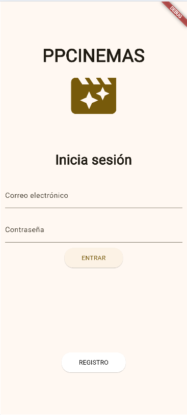
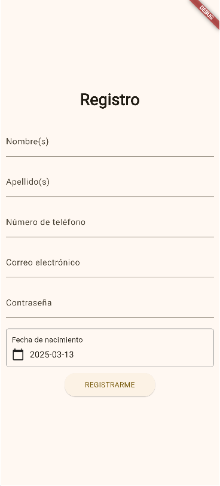
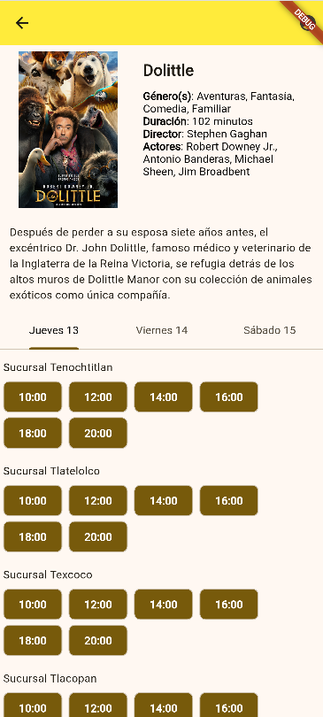
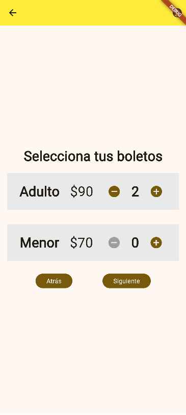
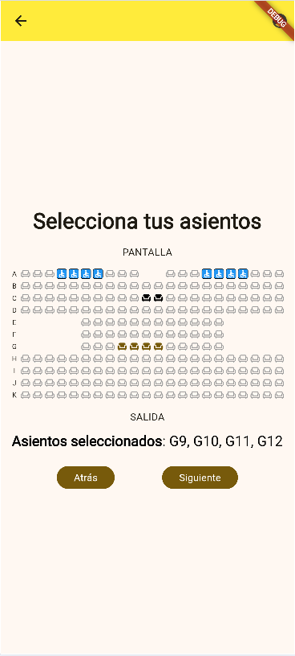
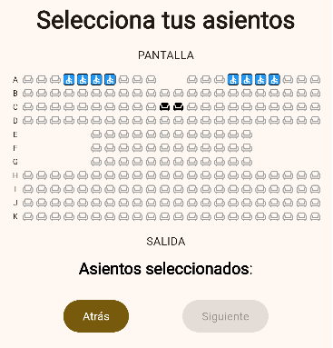
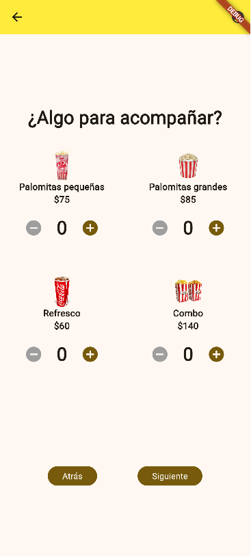
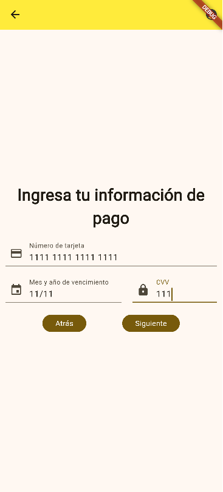
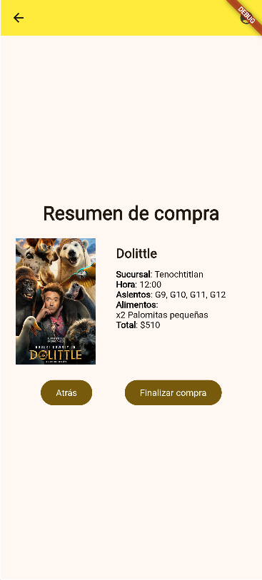
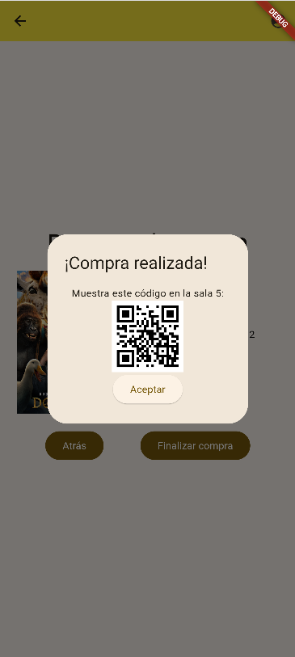

# ppcinemas

A proof-of-concept theater app designed for mobile devices built using **_Flutter_**.

**I do not claim ownership to any asset used in this project.** They are used exclusively for demonstrational purposes and belong to their respective owners.

## Screens

The app is composed by different screens that detail various stages of purchase inside a theather app.

[**Welcome and login screen**](https://github.com/vazquezjose/ppcinemas/blob/master/lib/screens/login.dart)
Includes the company logo and allows the input of login details. Also includes a button that allows the user to sign up into the app.


[**Sign up screen**](https://github.com/vazquezjose/ppcinemas/blob/master/lib/screens/register.dart)
Requests the user for the essential information needed to register an account.


[**Movie selection screen**](https://github.com/vazquezjose/ppcinemas/blob/master/lib/screens/movie_selection.dart)
Shows the available movies and allows the user to look one up by their title. Also includes a button that allows the user to see their account details _(top-right, unintentionally covered by the "Debug" ribbon)_.

> The shown movies are fed to the carousel and the grid by [this class](https://github.com/vazquezjose/ppcinemas/blob/master/lib/services/info_provider.dart).


[**Movie details screen**](https://github.com/vazquezjose/ppcinemas/blob/master/lib/screens/movie_details.dart)
Shows the details and the available showtimes per day and per location of the chosen movie.


[**Ticket amount selection screen**](https://github.com/vazquezjose/ppcinemas/blob/master/lib/screens/movie_seat_amount_selection.dart)
Allows the user to select the amount of adult or minor tickets they wish to buy.


[**Movie seat selection screen**](https://github.com/vazquezjose/ppcinemas/blob/master/lib/screens/movie_seat_selection.dart)
Allows the user to choose the location of their seats based on the seat availability.

> The app allows the definition of a custom seating design in the *functionSeats* array from [this class](https://github.com/vazquezjose/ppcinemas/blob/master/lib/services/info_provider.dart).
> **A** stands for an available seat.
> **X** stands for an occupied seat.
> **W** stands for an available wheelchair exclusive seat.
> **O** defines empty space between seats.
```dart
static final functionSeats = [
	'AAAWWWWAAAOOAAAWWWWAAA',
	'AAAAAAAAAAAAAAAAAAAAAA',
	'AAAAAAAAAAXXAAAAAAAAAA',
	'AAAAAAAAAAAAAAAAAAAAAA',
	'OOOOOAAAAAAAAAAAAOOOOO',
	'OOOOOAAAAAAAAAAAAOOOOO',
	'OOOOOAAAAAAAAAAAAOOOOO',
	'AAAAAAAAAAAAAAAAAAAAAA',
	'AAAAAAAAAAAAAAAAAAAAAA',
	'AAAAAAAAAAAAAAAAAAAAAA',
	'AAAAAAAAAAAAAAAAAAAAAA'
];
```
This `functionSeats` will look like this in-app:


[**Snack screen**](https://github.com/vazquezjose/ppcinemas/blob/master/lib/screens/snack.dart)
Allows the user to add snacks to their order.


[**Payment info screen**](https://github.com/vazquezjose/ppcinemas/blob/master/lib/screens/card_info.dart)
Asks the user for their payment details.


[**Order summary screen**](https://github.com/vazquezjose/ppcinemas/blob/master/lib/screens/confirm_purchase.dart)
Shows the user a summary of their order and allows them to conclude it,  generating a QR code that will allow them to claim their order on-site.

